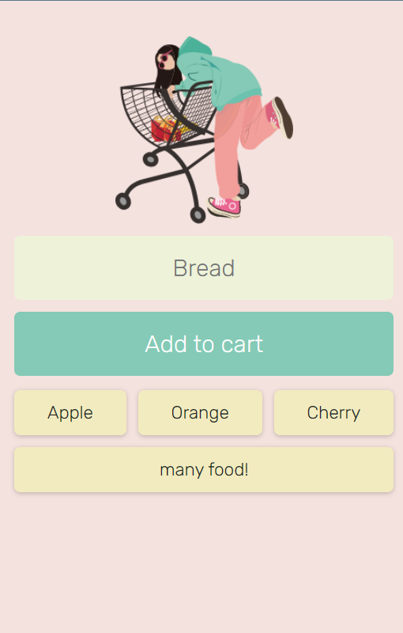

# Shopping-List

## Overview

 A simple shopping list app written from Scrimba, using HTML, CSS, JavaScript and Firebase. This tiny app is very useful!

## Screenshots

### How to use

* Input the items you want to buy in the first row
* Click "Add to cart" button, then it will be store in the light yellow box blow
* Click the yellow box when you want to delete it

## Links

* 🎈Netlify: https://shopping-list-orangerun.netlify.app/
